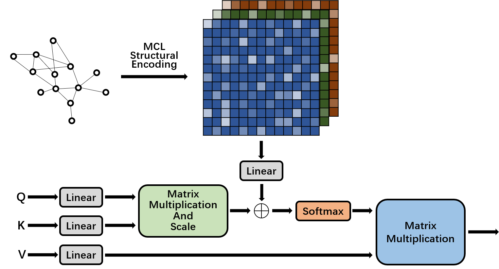

# Graph Transformer Structural Encoding Based on  MCL Algorithm



We propose a general structural encoding method for graph Transformer.And experimented on the OGB graph classification task ogbg-ppa.

## Requirements

ogb==1.3.3
torch==1.10.2
torch_geometric==2.0.4
tqdm==4.64.0

## Training & Evaluation

### ogbg-ppa

```shell
# $INFLA and $OUTPUT are described below.
python main.py --infla $INFLA --output $OUTPUT
```

- `$INFLA`: MCL encoding granularity can be changed by changing this parameter. Leaving this parameter unfilled means that the default INFLA(6) is used. This parameter can also be entered as an array of float types for a multi-scale encoding effect(For example: `--infla 3.0 6.0 9.0`).
- `$OUTPUT`: Specifying output files. The contents of the output file contain the hyperparameters used in the training, as well as the final Train ACC, Validation ACC and Test ACC.

## Performance

### ogbg-ppa

|  **Methods**  |      **Train ACC**      |   **Validation ACC**    |      **Test ACC**       | Hardware |
| :-----------: | :---------------------: | :---------------------: | :---------------------: | :------: |
| GC-T+MCL(6.0) | 0.999719 $\pm$ 0.000318 | 0.698900 $\pm$ 0.003674 | 0.743190 $\pm$ 0.003319 | RTX3090  |

## References

1.https://github.com/snap-stanford/ogb/tree/master/examples/graphproppred/ppa

